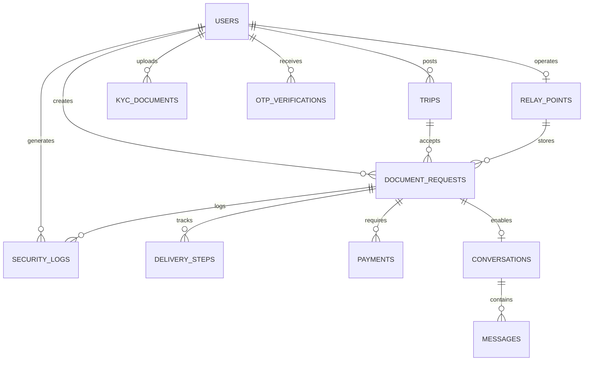

# DocUrgent - Technical Architecture Documentation

## 📋 Executive Summary

**DocUrgent** is a secure document-delivery and tracking platform connecting **Senders**, **Relay Points**, **Travelers**, and **Receivers** through identity verification, tracking codes, and controlled handovers.

This document outlines the complete technical architecture, technology stack, database schema, and implementation details for the DocUrgent SaaS platform.

---

## 🎯 Platform Overview

### Core Workflow


### Four Key Actors

1. **👤 Sender (Expéditeur)** - Initiates document delivery
2. **🏪 Relay Point** - Physical verification and handoff location
3. **✈️ Traveler (Voyageur)** - Carries documents between cities
4. **📨 Receiver (Destinataire)** - Final recipient of documents

---

## 🛠️ Technology Stack

### Backend Framework

| Component | Technology | Version | Purpose |
|-----------|-----------|---------|---------|
| **Framework** | FastAPI | 0.109.0 | High-performance async API framework |
| **Server** | Uvicorn | 0.27.0 | ASGI server with WebSocket support |
| **Production Server** | Gunicorn | 21.2.0 | Production-grade WSGI server |
| **Language** | Python | 3.11+ | Modern Python with type hints |

### Database & ORM

| Component | Technology | Version | Purpose |
|-----------|-----------|---------|---------|
| **Database** | PostgreSQL | 15+ | Primary relational database |
| **ORM** | SQLAlchemy | 2.0.25 | Database abstraction layer |
| **Migrations** | Alembic | 1.13.1 | Database schema versioning |
| **Driver** | psycopg2-binary | 2.9.9 | PostgreSQL adapter |

### Authentication & Security

| Component | Technology | Version | Purpose |
|-----------|-----------|---------|---------|
| **JWT** | python-jose | 3.3.0 | Token generation and validation |
| **Password Hashing** | passlib[bcrypt] | 1.7.4 | Secure password storage |
| **Token Library** | PyJWT | 2.8.0 | JWT encoding/decoding |
| **Validation** | Pydantic | 2.5.3 | Data validation and settings |

### Caching & Background Tasks

| Component | Technology | Version | Purpose |
|-----------|-----------|---------|---------|
| **Cache** | Redis | 5.0.1 | Session storage, rate limiting |
| **Redis Client** | hiredis | 2.3.2 | High-performance Redis protocol |
| **Task Queue** | Celery | 5.3.4 | Asynchronous task processing |
| **Monitoring** | Flower | 2.0.1 | Celery task monitoring UI |

### Storage & File Management

| Component | Technology | Version | Purpose |
|-----------|-----------|---------|---------|
| **Object Storage** | MinIO | 7.2.3 | S3-compatible file storage |
| **QR Codes** | qrcode[pil] | 7.4.2 | QR code generation |
| **Image Processing** | Pillow | 10.1.0 | Image manipulation |

### Communication Services

| Component | Technology | Version | Purpose |
|-----------|-----------|---------|---------|
| **Email** | aiosmtplib | 3.0.1 | Async email sending |
| **SMS** | Twilio | 8.11.0 | Phone verification & notifications |
| **WebSocket** | websockets | 12.0 | Real-time chat support |
| **Socket.IO** | python-socketio | 5.10.0 | Real-time bidirectional communication |

### Payment Processing

| Component | Technology | Version | Purpose |
|-----------|-----------|---------|---------|
| **Payment Gateway** | Stripe | 7.8.0 | Payment processing & escrow |

### DevOps & Infrastructure

| Component | Technology | Purpose |
|-----------|-----------|---------|
| **Containerization** | Docker | Application containerization |
| **Orchestration** | Docker Compose | Local development environment |
| **CI/CD** | Jenkins | Continuous integration pipeline |
| **GitOps** | ArgoCD | Kubernetes deployment automation |
| **Container Orchestration** | Kubernetes | Production container orchestration |
| **Reverse Proxy** | NGINX | Load balancing & SSL termination |

### Testing & Quality

| Component | Technology | Version | Purpose |
|-----------|-----------|---------|---------|
| **Testing Framework** | pytest | 7.4.4 | Unit and integration testing |
| **Async Testing** | pytest-asyncio | 0.23.3 | Async test support |
| **Coverage** | pytest-cov | 4.1.0 | Code coverage reporting |
| **HTTP Client** | httpx | 0.26.0 | API testing |
| **Code Formatting** | black | 23.12.1 | Code formatting |
| **Linting** | flake8 | 7.0.0 | Code quality checks |
| **Type Checking** | mypy | 1.8.0 | Static type checking |

---

## 🗄️ Database Schema

### Entity Relationship Diagram



### Core Tables

#### 1. **users** - User Authentication & Profiles

| Column | Type | Constraints | Description |
|--------|------|-------------|-------------|
| `id` | VARCHAR(36) | PRIMARY KEY | UUID identifier |
| `email` | VARCHAR(255) | UNIQUE, INDEX | User email (optional) |
| `phone` | VARCHAR(50) | UNIQUE, NOT NULL, INDEX | Phone number (required) |
| `hashed_password` | VARCHAR(255) | NOT NULL | Bcrypt hashed password |
| `first_name` | VARCHAR(100) | NOT NULL | First name |
| `last_name` | VARCHAR(100) | NOT NULL | Last name |
| `date_of_birth` | TIMESTAMP | NULL | Date of birth |
| `residence_city` | VARCHAR(100) | NULL | City of residence |
| `address` | VARCHAR(500) | NULL | Full address |
| `country` | VARCHAR(100) | NULL | Country |
| `user_type` | ENUM | NOT NULL | sender, traveler, relay_point, recipient, admin |
| `is_phone_verified` | BOOLEAN | DEFAULT FALSE | Phone verification status |
| `is_email_verified` | BOOLEAN | DEFAULT FALSE | Email verification status |
| `verification_status` | ENUM | DEFAULT unverified | unverified, pending, verified, rejected |
| `is_active` | BOOLEAN | DEFAULT TRUE | Account active status |
| `created_at` | TIMESTAMP | NOT NULL | Account creation timestamp |
| `updated_at` | TIMESTAMP | NOT NULL | Last update timestamp |
| `last_login` | TIMESTAMP | NULL | Last login timestamp |

**Indexes:**
- `idx_users_phone` on `phone`
- `idx_users_email` on `email`
- `idx_users_user_type` on `user_type`

---

#### 2. **document_requests** - Core Shipment Tracking

| Column | Type | Constraints | Description |
|--------|------|-------------|-------------|
| `id` | VARCHAR(36) | PRIMARY KEY | UUID identifier |
| `sender_id` | VARCHAR(36) | FK → users.id, NOT NULL | Sender user ID |
| `sender_name` | VARCHAR(255) | NOT NULL | Sender full name |
| `sender_phone` | VARCHAR(50) | NOT NULL | Sender phone |
| `source_address` | VARCHAR(500) | NOT NULL | Pickup address |
| `recipient_name` | VARCHAR(255) | NOT NULL | Receiver full name |
| `recipient_phone` | VARCHAR(50) | NOT NULL | Receiver phone |
| `destination_address` | VARCHAR(500) | NOT NULL | Delivery address |
| `document_type` | ENUM | NOT NULL | passport_copy, birth_certificate, etc. |
| `document_description` | TEXT | NULL | Document details |
| `traveler_id` | VARCHAR(36) | FK → users.id, NULL | Assigned traveler |
| `trip_id` | VARCHAR(36) | FK → trips.id, NULL | Associated trip |
| `relay_point_id` | VARCHAR(36) | FK → relay_points.id, NULL | Relay point location |
| `unique_code` | VARCHAR(20) | UNIQUE, NOT NULL, INDEX | Sender verification code |
| `delivery_code` | VARCHAR(20) | NOT NULL | Receiver delivery code |
| `qr_code_url` | VARCHAR(500) | NULL | QR code image URL |
| `status` | ENUM | NOT NULL, DEFAULT created | Shipment status |
| `offered_price` | VARCHAR(10) | DEFAULT '0' | Price in euros (string) |
| `created_at` | TIMESTAMP | NOT NULL | Creation timestamp |
| `updated_at` | TIMESTAMP | NOT NULL | Last update timestamp |
| `completed_at` | TIMESTAMP | NULL | Completion timestamp |
| `completed_by` | VARCHAR(36) | NULL | User who completed |

**Status Enum:** `created`, `at_relay_point`, `with_traveler`, `delivered`, `confirmed`, `completed`, `cancelled`

**Indexes:**
- `idx_document_requests_unique_code` on `unique_code`
- `idx_document_requests_status` on `status`
- `idx_document_requests_sender_id` on `sender_id`

---

#### 3. **trips** - Traveler Journey Information

| Column | Type | Constraints | Description |
|--------|------|-------------|-------------|
| `id` | VARCHAR(36) | PRIMARY KEY | UUID identifier |
| `traveler_id` | VARCHAR(36) | FK → users.id, NOT NULL | Traveler user ID |
| `departure_city` | VARCHAR(100) | NOT NULL | Origin city |
| `departure_date` | DATE | NOT NULL | Departure date |
| `departure_country` | VARCHAR(100) | DEFAULT 'France' | Origin country |
| `destination_city` | VARCHAR(100) | NOT NULL | Destination city |
| `destination_country` | VARCHAR(100) | NOT NULL | Destination country |
| `arrival_date` | DATE | NULL | Expected arrival |
| `airline` | VARCHAR(100) | NULL | Airline name |
| `flight_number` | VARCHAR(50) | NULL | Flight number |
| `spots_available` | INTEGER | DEFAULT 1 | Total capacity |
| `spots_taken` | INTEGER | DEFAULT 0 | Used capacity |
| `price_per_document` | INTEGER | DEFAULT 20 | Price in euros |
| `is_active` | BOOLEAN | DEFAULT TRUE | Trip active status |
| `created_at` | TIMESTAMP | NOT NULL | Creation timestamp |
| `updated_at` | TIMESTAMP | NOT NULL | Last update timestamp |

**Indexes:**
- `idx_trips_traveler_id` on `traveler_id`
- `idx_trips_departure_date` on `departure_date`
- `idx_trips_is_active` on `is_active`

---

#### 4. **relay_points** - Physical Handoff Locations

| Column | Type | Constraints | Description |
|--------|------|-------------|-------------|
| `id` | VARCHAR(36) | PRIMARY KEY | UUID identifier |
| `user_id` | VARCHAR(36) | FK → users.id, UNIQUE, NOT NULL | Operator user ID |
| `location_name` | VARCHAR(255) | NOT NULL | Business name |
| `address` | VARCHAR(500) | NOT NULL | Full address |
| `city` | VARCHAR(100) | NOT NULL | City |
| `country` | VARCHAR(100) | NOT NULL | Country |
| `postal_code` | VARCHAR(20) | NULL | Postal code |
| `latitude` | FLOAT | NULL | GPS latitude |
| `longitude` | FLOAT | NULL | GPS longitude |
| `phone` | VARCHAR(50) | NULL | Contact phone |
| `email` | VARCHAR(255) | NULL | Contact email |
| `operating_hours` | VARCHAR(500) | NULL | Business hours (JSON) |
| `is_verified` | BOOLEAN | DEFAULT FALSE | Admin verification |
| `is_active` | BOOLEAN | DEFAULT TRUE | Active status |
| `created_at` | TIMESTAMP | NOT NULL | Creation timestamp |
| `updated_at` | TIMESTAMP | NOT NULL | Last update timestamp |

**Indexes:**
- `idx_relay_points_city` on `city`
- `idx_relay_points_is_verified` on `is_verified`

---

#### 5. **delivery_steps** - Shipment Progress Tracking

| Column | Type | Constraints | Description |
|--------|------|-------------|-------------|
| `id` | VARCHAR(36) | PRIMARY KEY | UUID identifier |
| `document_request_id` | VARCHAR(36) | FK → document_requests.id, NOT NULL | Shipment ID |
| `step_id` | VARCHAR(50) | NOT NULL | Step identifier |
| `step_name` | VARCHAR(100) | NOT NULL | Step description |
| `completed` | BOOLEAN | DEFAULT FALSE | Completion status |
| `completed_at` | TIMESTAMP | NULL | Completion timestamp |
| `completed_by` | VARCHAR(36) | NULL | User who completed |
| `created_at` | TIMESTAMP | NOT NULL | Creation timestamp |

**Standard Steps:**
1. `collect_envelope` - Relay Point receives from Sender
2. `take_plane` - Traveler picks up from Relay Point
3. `landed` - Traveler arrives at destination
4. `handed_envelope` - Receiver confirms delivery

---

#### 6. **otp_verifications** - Phone Number Verification

| Column | Type | Constraints | Description |
|--------|------|-------------|-------------|
| `id` | VARCHAR(36) | PRIMARY KEY | UUID identifier |
| `user_id` | VARCHAR(36) | FK → users.id, NULL | Associated user |
| `phone_number` | VARCHAR(50) | NOT NULL, INDEX | Phone to verify |
| `otp_code` | VARCHAR(10) | NOT NULL | 6-digit OTP code |
| `is_verified` | BOOLEAN | DEFAULT FALSE | Verification status |
| `verified_at` | TIMESTAMP | NULL | Verification timestamp |
| `expires_at` | TIMESTAMP | NOT NULL | Expiration timestamp |
| `attempts` | INTEGER | DEFAULT 0 | Verification attempts |
| `max_attempts` | INTEGER | DEFAULT 3 | Maximum attempts |
| `created_at` | TIMESTAMP | NOT NULL | Creation timestamp |

**Indexes:**
- `idx_otp_phone_number` on `phone_number`

---

#### 7. **kyc_documents** - Identity Verification

| Column | Type | Constraints | Description |
|--------|------|-------------|-------------|
| `id` | VARCHAR(36) | PRIMARY KEY | UUID identifier |
| `user_id` | VARCHAR(36) | FK → users.id, NOT NULL | User ID |
| `document_type` | ENUM | NOT NULL | national_id, passport, drivers_license |
| `document_number` | VARCHAR(100) | NULL | ID number |
| `front_image_url` | VARCHAR(500) | NULL | Front image URL |
| `back_image_url` | VARCHAR(500) | NULL | Back image URL |
| `selfie_url` | VARCHAR(500) | NULL | Selfie URL |
| `is_verified` | BOOLEAN | DEFAULT FALSE | Verification status |
| `verified_at` | TIMESTAMP | NULL | Verification timestamp |
| `verified_by` | VARCHAR(36) | NULL | Admin who verified |
| `rejection_reason` | VARCHAR(500) | NULL | Rejection reason |
| `created_at` | TIMESTAMP | NOT NULL | Upload timestamp |
| `updated_at` | TIMESTAMP | NOT NULL | Last update timestamp |

---

#### 8. **payments** - Escrow & Transaction Management

| Column | Type | Constraints | Description |
|--------|------|-------------|-------------|
| `id` | VARCHAR(36) | PRIMARY KEY | UUID identifier |
| `document_request_id` | VARCHAR(36) | FK → document_requests.id, NOT NULL | Shipment ID |
| `sender_id` | VARCHAR(36) | FK → users.id, NOT NULL | Payer user ID |
| `traveler_id` | VARCHAR(36) | FK → users.id, NULL | Payee user ID |
| `amount_cents` | INTEGER | NOT NULL | Amount in cents |
| `currency` | VARCHAR(3) | DEFAULT 'EUR' | Currency code |
| `payment_method` | ENUM | NOT NULL | stripe, paypal, card |
| `stripe_payment_intent_id` | VARCHAR(255) | UNIQUE, NULL | Stripe payment ID |
| `stripe_session_id` | VARCHAR(255) | UNIQUE, NULL | Stripe session ID |
| `status` | ENUM | NOT NULL, DEFAULT pending | Payment status |
| `is_escrowed` | BOOLEAN | DEFAULT FALSE | Escrow status |
| `escrowed_at` | TIMESTAMP | NULL | Escrow timestamp |
| `released_at` | TIMESTAMP | NULL | Release timestamp |
| `created_at` | TIMESTAMP | NOT NULL | Creation timestamp |
| `updated_at` | TIMESTAMP | NOT NULL | Last update timestamp |

**Status Enum:** `pending`, `completed`, `failed`, `refunded`, `escrowed`, `released`

---

#### 9. **conversations** - Chat Between Users

| Column | Type | Constraints | Description |
|--------|------|-------------|-------------|
| `id` | VARCHAR(36) | PRIMARY KEY | UUID identifier |
| `document_request_id` | VARCHAR(36) | FK → document_requests.id, NOT NULL | Related shipment |
| `participant_1_id` | VARCHAR(36) | FK → users.id, NOT NULL | First participant |
| `participant_2_id` | VARCHAR(36) | FK → users.id, NOT NULL | Second participant |
| `is_active` | BOOLEAN | DEFAULT TRUE | Conversation status |
| `created_at` | TIMESTAMP | NOT NULL | Creation timestamp |
| `updated_at` | TIMESTAMP | NOT NULL | Last message timestamp |

---

#### 10. **messages** - Chat Messages

| Column | Type | Constraints | Description |
|--------|------|-------------|-------------|
| `id` | VARCHAR(36) | PRIMARY KEY | UUID identifier |
| `conversation_id` | VARCHAR(36) | FK → conversations.id, NOT NULL | Conversation ID |
| `sender_id` | VARCHAR(36) | FK → users.id, NOT NULL | Message sender |
| `content` | TEXT | NOT NULL | Message content |
| `is_read` | BOOLEAN | DEFAULT FALSE | Read status |
| `read_at` | TIMESTAMP | NULL | Read timestamp |
| `created_at` | TIMESTAMP | NOT NULL | Send timestamp |

---

#### 11. **security_logs** - Audit Trail

| Column | Type | Constraints | Description |
|--------|------|-------------|-------------|
| `id` | VARCHAR(36) | PRIMARY KEY | UUID identifier |
| `action` | VARCHAR(100) | NOT NULL, INDEX | Action performed |
| `details` | TEXT | NULL | Action details |
| `user_id` | VARCHAR(36) | FK → users.id, NULL | User who performed action |
| `document_request_id` | VARCHAR(36) | FK → document_requests.id, NULL | Related shipment |
| `ip_address` | VARCHAR(50) | NULL | Request IP |
| `user_agent` | VARCHAR(500) | NULL | Browser/client info |
| `timestamp` | TIMESTAMP | NOT NULL, INDEX | Event timestamp |

**Indexes:**
- `idx_security_logs_action` on `action`
- `idx_security_logs_timestamp` on `timestamp`

---

## 🔐 Security Features

### 1. **Multi-Factor Authentication**
- Phone number verification via Twilio OTP
- Email verification (optional)
- KYC document verification for high-value transactions

### 2. **Code Verification System**
- **Unique Code**: Sender → Relay Point verification
- **Delivery Code**: Receiver → Traveler confirmation
- **Traveler Code**: Traveler → Relay Point pickup

### 3. **Audit Logging**
- All critical actions logged in `security_logs`
- IP address and user agent tracking
- Immutable audit trail

### 4. **Payment Security**
- Stripe-powered escrow system
- Payment held until delivery confirmation
- Automatic refund on cancellation

---

## 📊 API Architecture

### Base URL Structure
```
https://api.docurgent.com/api/v1/
```

### Authentication
All protected endpoints require JWT Bearer token:
```
Authorization: Bearer <access_token>
```

### Core Endpoint Groups

#### 1. Authentication (`/auth`)
- `POST /auth/register` - User registration
- `POST /auth/login` - User login
- `POST /auth/verify-phone` - OTP verification
- `POST /auth/refresh-token` - Token refresh

#### 2. Users (`/users`)
- `GET /users/me` - Current user profile
- `PUT /users/me` - Update profile
- `POST /users/kyc` - Upload KYC documents

#### 3. Shipments (`/shipments`)
- `POST /shipments` - Create new shipment
- `GET /shipments` - List user shipments
- `GET /shipments/{id}` - Get shipment details
- `PUT /shipments/{id}/status` - Update status
- `POST /shipments/{id}/verify-code` - Verify delivery code

#### 4. Trips (`/trips`)
- `POST /trips` - Create trip
- `GET /trips` - Search available trips
- `GET /trips/{id}` - Trip details
- `POST /trips/{id}/accept-shipment` - Accept shipment

#### 5. Relay Points (`/relay-points`)
- `POST /relay-points` - Register relay point
- `GET /relay-points` - Search relay points
- `POST /relay-points/verify-sender` - Verify sender identity
- `POST /relay-points/handoff-traveler` - Hand to traveler

#### 6. Payments (`/payments`)
- `POST /payments/create-intent` - Create Stripe payment
- `POST /payments/confirm` - Confirm payment
- `POST /payments/release-escrow` - Release to traveler

#### 7. Chat (`/chat`)
- `GET /chat/conversations` - List conversations
- `POST /chat/messages` - Send message
- `GET /chat/messages/{conversation_id}` - Get messages

---

## 🔄 Complete Delivery Workflow

### Step 1: Sender Creates Shipment
```
POST /api/v1/shipments
{
  "sender_name": "John Doe",
  "sender_phone": "+33612345678",
  "source_address": "123 Rue Paris, 75001 Paris",
  "recipient_name": "Jane Smith",
  "recipient_phone": "+212612345678",
  "destination_address": "456 Bd Mohammed V, Casablanca",
  "document_type": "passport_copy",
  "document_description": "Passport copy for visa application"
}

Response:
{
  "id": "uuid-123",
  "unique_code": "ABC123",
  "delivery_code": "XYZ789",
  "status": "created"
}
```

### Step 2: Sender → Relay Point
1. Sender goes to Relay Point with envelope
2. Relay Point scans `unique_code` to verify sender
3. Relay Point checks envelope integrity
4. Status → `at_relay_point`

### Step 3: Traveler Pickup
1. Traveler shows ID at Relay Point
2. Traveler provides Traveler Code
3. Relay Point hands envelope to Traveler
4. Status → `with_traveler`

### Step 4: Delivery to Receiver
1. Receiver provides `delivery_code` to Traveler
2. Traveler enters code in platform
3. Status → `delivered`
4. Payment released from escrow to Traveler

---

## 🚀 Deployment Architecture

### Development Environment
```
docker-compose up
```
Services:
- PostgreSQL (port 5432)
- Redis (port 6379)
- MinIO (port 9000)
- FastAPI Backend (port 8000)
- Celery Worker
- NGINX (port 80)

### Production Kubernetes
```
Namespace: docurgent
- Deployment: docurgent-backend (3 replicas)
- Deployment: celery-worker (2 replicas)
- StatefulSet: postgresql
- StatefulSet: redis
- Service: LoadBalancer (NGINX Ingress)
```

---

## 📈 Scalability Considerations

### Horizontal Scaling
- Stateless FastAPI instances behind load balancer
- Celery workers can scale independently
- Redis cluster for high availability

### Database Optimization
- Indexed columns for fast lookups
- Connection pooling (pool_size=10, max_overflow=20)
- Read replicas for analytics queries

### Caching Strategy
- User sessions in Redis
- Frequently accessed shipment data cached
- Rate limiting per user/IP

---

## 🔧 Configuration Management

### Environment Variables
All sensitive configuration stored in `.env`:
- Database credentials
- JWT secret keys
- Stripe API keys
- Twilio credentials
- SMTP settings

### Secrets Management
- Kubernetes Secrets for production
- HashiCorp Vault for enterprise deployments
- Encrypted at rest and in transit

---

## 📝 Next Steps

1. ✅ Review this architecture document
2. ⏳ Run database initialization script
3. ⏳ Configure environment variables
4. ⏳ Start development server
5. ⏳ Test API endpoints
6. ⏳ Deploy to staging environment

---

**Document Version:** 1.0  
**Last Updated:** 2025-11-30  
**Maintained By:** DocUrgent Development Team
